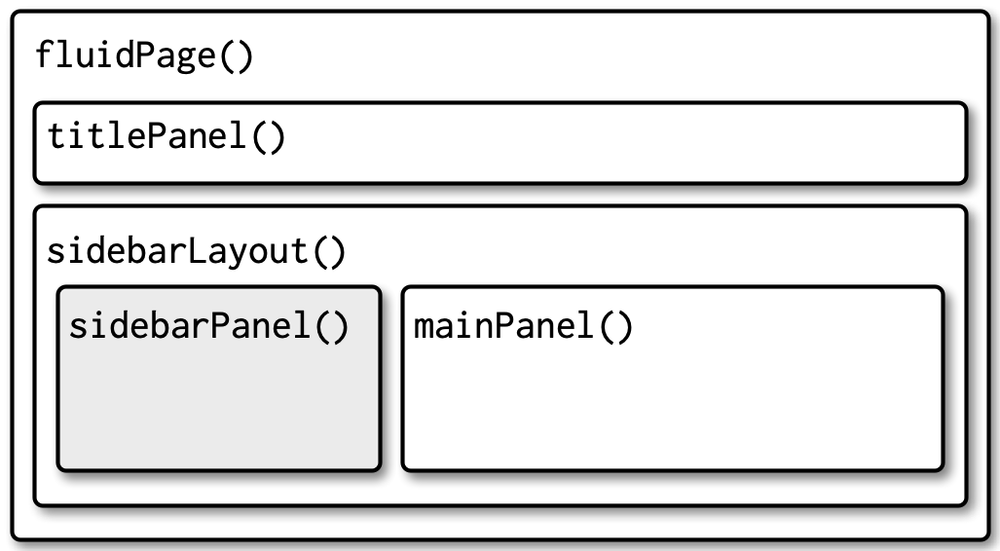

# Chap 6: Layout and themes of Shiny App

## 1. Single page layouts

-   Layout function: provide high-level visual structure of an app
-   Created by a hyerarchy of function calls
-   Example:

```         
fluidPage(
  titlePanel("Hello Shiny!"),
  sidebarLayout(
    sidebarPanel(
      sliderInput("obs", "Observations:", min = 0, max = 1000, value = 500)
    ),
    mainPanel(
      plotOutput("distPlot")
    )
  )
)
```

Focus on the hierarchy:

```         
fluidPage(
  titlePanel(),
  sidebarLayout(
    sidebarPanel(),
    mainPanel()
  )
)
```

### 1.1. Page functions

-   Most important layout function: [`fluidPage()`](https://rdrr.io/cran/shiny/man/fluidPage.html)
    -   A fluid page layout consists of rows which in turn include columns
    -   Rows exist for the purpose of making sure their elements appear on the same line
    -   Columns exist for the purpose of defining how much horizontal space within a 12-unit wide grid it's elements should occupy
    -   Fluid pages scale their components in realtime to fill all available browser width
-   Other functions:
    -   [`fixedPage()`](https://rdrr.io/cran/shiny/man/fixedPage.html) : has a fixed maximum width, which stops your apps from becoming unreasonable wide on bigger screens
    -   [`fillPage()`](https://rdrr.io/cran/shiny/man/fillPage.html) : fill the full height of the browser

### 1.2. Pgae with sidebar

-   To make two-column layout with inputs on the left and output on the right: use `sidebarLayout()` (along with `titlePanel()`, `sidebarPanel`, and `mainPanel()`)
-   Syntax:

```         
fluidPage(
  titlePanel(
    # app title/description
  ),
  sidebarLayout(
    sidebarPanel(
      # inputs
    ),
    mainPanel(
      # outputs
    )
  )
)
```

{fig-align="center" width="9.6cm"}

-   Example: Illustration of Central Limit Theorem

```{r}

library(shiny)

ui <- fluidPage(
  titlePanel("Central limit theorem"),
  sidebarLayout(
    sidebarPanel(
      numericInput("m", "Number of samples:", 2, min = 1, max = 100)
    ),
    mainPanel(
      plotOutput("hist")
    )
  )
)

server <- function(input, output, session) {
  output$hist <- renderPlot({
    means <- replicate(1e4, mean(runif(input$m)))
    hist(means, breaks = 20)
  }, res = 96)
}


shinyApp(ui, server)
```

### 1.3. Multi-row

-   All elements within a `fluidRow()` appears on the same line
-   Each row is made up of 12 columns and the first argument `column()` gives how many of those columns to occupy
-   Syntax:

```         
fluidPage(
  fluidRow(
    column(4, 
      ...
    ),
    column(8, 
      ...
    )
  ),
  fluidRow(
    column(6, 
      ...
    ),
    column(6, 
      ...
    )
  )
)
```

{fig-align="center" width="10.8cm"}

**Exercise:** Modify the Central Limit Theorem app to put the sidebar on the right instead of the left

```{r}
ui <- fluidPage(
  titlePanel("Central limit theorem"),
    fluidRow(
      column(8, 
        plotOutput("hist")
        ),
    column(4, 
      numericInput("m", "Number of samples:", 2, min = 1, max = 100)
    )
    )
  )

server <- function(input, output, session) {
  output$hist <- renderPlot({
    means <- replicate(1e4, mean(runif(input$m)))
    hist(means, breaks = 20)
  }, res = 96)
}

shinyApp(ui, server)
```

## 2. Multi-page layouts

### 2.1. Tabsets

- [`tabsetPanel`](https://rdrr.io/cran/shiny/man/tabsetPanel.html) and [`tabPanel()`](https://rdrr.io/cran/shiny/man/tabPanel.html): create illusion of multiple pages
- tabsetPanel() creates a container for any number of tabPanels(), which can in turn contain any other HTML components. 
- Example: 

```
ui <- fluidPage(
  tabsetPanel(
    tabPanel("Import data", 
      fileInput("file", "Data", buttonLabel = "Upload..."),
      textInput("delim", "Delimiter (leave blank to guess)", ""),
      numericInput("skip", "Rows to skip", 0, min = 0),
      numericInput("rows", "Rows to preview", 10, min = 1)
    ),
    tabPanel("Set parameters"),
    tabPanel("Visualise results")
  )
)
```

{fig-align="center" width="10.8cm"}

### 2.2. Navlists and navbars

- `navlistPanel()` is similar to `tabsetPanel()` but instead of running the tab titles horizontally, it shows them vertically in a sidebar
  + Also allows you to add headings with plain strings

``` {r}
ui <- fluidPage(
  navlistPanel(
    id = "tabset",
    "Heading 1",
    tabPanel("panel 1", "Panel one contents"),
    "Heading 2",
    tabPanel("panel 2", "Panel two contents"),
    tabPanel("panel 3", "Panel three contents")
  )
)

server <- function(input, output, session) {}

shinyApp(ui, server)
```

- `navbarPage()`: it still runs the tab titles horizontally, but you can use navbarMenu() to add drop-down menus for an additional level of hierarchy

```{r}
ui <- navbarPage(
  "Page title",   
  tabPanel("panel 1", "one"),
  tabPanel("panel 2", "two"),
  tabPanel("panel 3", "three"),
  navbarMenu("subpanels", 
    tabPanel("panel 4a", "four-a"),
    tabPanel("panel 4b", "four-b"),
    tabPanel("panel 4c", "four-c")
  )
)

server <- function(input, output, session) {}

shinyApp(ui, server)
```

## 3. Bootstrap

- Bootstrap is a collection of HTML conventions, CSS styles, and JavaScipt snippets bundled up into a convenient form
- Shiny functions automatically generate bootstrap compatible HTML for you
- Some useful features:
  + use `bslib::bs_theme()` to customise the visual appearance of your code
  + use the `class` argument to customise some layouts, inputs, and outputs using Bootstrap class names
  + can make your own functions to generate Bootstrap components that Shiny doesn’t provide, as explained in [“Utility classes”](https://rstudio.github.io/bslib/articles/utility-classes/index.html)
  
## 4. Create themes

Create a theme with `bslib::bs_theme()` then apply it to an app with the theme argument of the page layout function

```
fluidPage(
  theme = bslib::bs_theme(...)
)
```

### 4.1. Shiny themes

- Pick premate ["bootswatch"](https://bootswatch.com/) theme using the `bootswatch` argument to `bslib::bs_theme()`

```{r}
ui <- fluidPage(
  theme = bslib::bs_theme(bootswatch = "sandstone"),
  sidebarLayout(
    sidebarPanel(
      textInput("txt", "Text input:", "text here"),
      sliderInput("slider", "Slider input:", 1, 100, 30)
    ),
    mainPanel(
      h1(paste0("Theme: sandstone")),
      h2("Header 2"),
      p("Some text")
    )
  )
)

server <- function(input, output, session) {}

shinyApp(ui, server)
```

- Construc your own theme:
```
ui <- fluidPage(
  theme = bslib::bs_theme(
  bg = "#BB99CD", 
  fg = "white", 
  base_font = "Source Sans Pro"),
  sidebarLayout(
    sidebarPanel(
      textInput("txt", "Text input:", "text here"),
      sliderInput("slider", "Slider input:", 1, 100, 30)
    ),
    mainPanel(
      h1(paste0("Theme: Customized")),
      h2("Header 2"),
      p("Some text")
    )
  )
)

server <- function(input, output, session) {}

shinyApp(ui, server)
```

### 4.3. Plot themes

- `thematic_shiny()` in the server function: automatically themes ggplot2, lattice, and base plots to match the app theme
- Example:

```{r}
library(ggplot2)

ui <- fluidPage(
  theme = bslib::bs_theme(bootswatch = "darkly"),
  titlePanel("A themed plot"),
  plotOutput("plot"),
)

server <- function(input, output, session) {
  thematic::thematic_shiny()
  
  output$plot <- renderPlot({
    ggplot(mtcars, aes(wt, mpg)) +
      geom_point() +
      geom_smooth()
  }, res = 96)
}

shinyApp(ui, server)
```

## 5. Under the hood

- If you know some HTML and CSS, it’s possible to customise Shiny still further
- Tutorials: [HTML basics](https://developer.mozilla.org/en-US/docs/Learn/Getting_started_with_the_web/HTML_basics), [CSS basics](https://developer.mozilla.org/en-US/docs/Learn/Getting_started_with_the_web/CSS_basics)

- If you want to include additional CSS or JS dependencies you’ll need to learn htmltools::htmlDependency()

- Possible to add own HTML to the `ui`: including literal HTML with the `HTML()` function

```{r}
ui <- fluidPage(
  HTML(r"(
    <h1>This is a heading</h1>
    <p class="my-class">This is some text!</p>
    <ul>
      <li>First bullet</li>
      <li>Second bullet</li>
    </ul>
  )")
)

server <- function(input, output, session){}
shinyApp(ui, server)
```

- Alternatively: use HTML helper that Shiny provides
  + Regular functions for important elements like `h1()` and `p()`
  + All others can be accessed by other tags helper
  
```{r}
ui <- fluidPage(
  h1("This is a heading"),
  p("This is some text", class = "my-class"),
  tags$ul(
    tags$li("First bullet"), 
    tags$li("Second bullet")
  )
)

server <- function(input, output, session){}
shinyApp(ui, server)
```

- One advantage of generating HTML with code is that you can interweave existing Shiny components into a custom structure

```{r}
ui <- fluidPage(
  h1("This is a heading"),
  p("This is some text", class = "my-class"),
  tags$p(
  "You made ", 
  tags$b("$", textOutput("amount", inline = TRUE)),
  " in the last ", 
  textOutput("days", inline = TRUE),
  " days " 
  )
)


server <- function(input, output, session){
  output$amount <- renderText({200})
  output$days <- renderText({7})
}
shinyApp(ui, server)
```

- Further reading: [Outstanding User Interfaces with Shiny](https://unleash-shiny.rinterface.com/survival-kit-javascript)


